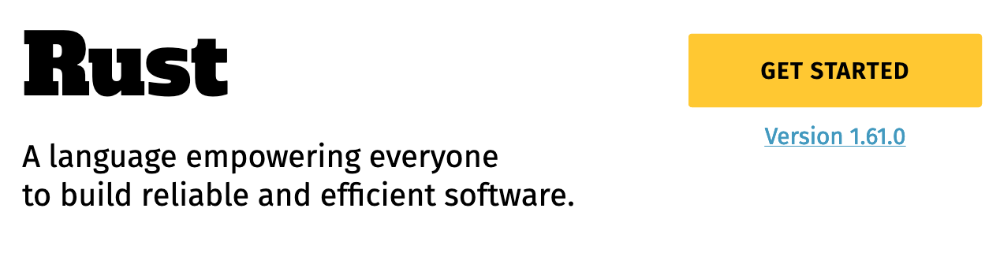
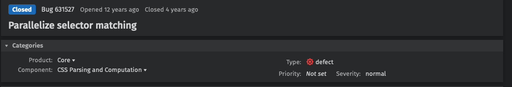
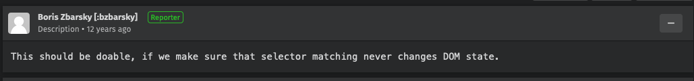
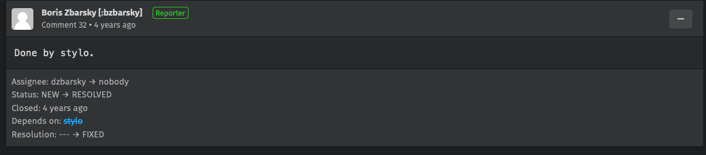

class: center
name: title
count: false

# Next steps for the Rust type system

.p60[]

Don't forget to update the title in [index.html](./index.html)

.me[.grey[*by* **Nicholas Matsakis**]]
.left[.citation[View slides at `https://nikomatsakis.github.io/ppl-2023/`]]

---

# Who is this guy

.text300[👋🏽 Hi!]

---

# Me

.p20[]

- Senior Principal Engineer at AWS
- Been working on Rust since 2011
- Co-lead of the Rust language design team
- Likes to blog ([babysteps])

[babysteps]: https://smallcultfollowing.com/babysteps/

---

# Rust sprouting up all over


... and those are just the foundation platinum sponsors.

---

# What are people doing with Rust?

All kinds of things...

- Networking
- Embedded development
- Kernels, kernel modules
- Blockchain
- CLI apps (ripgrep, just, tokei, ...)
- ...and much more

---

# Why work on Rust?

???

Why work on Rust for so long?

Do I just hate garbage collectors?

--


???

No, though I do think they have a tendency to make a mess.

---

# Why work on Rust?

???

I love Rust because I like to see people cool stuff, and Rust is great at that.

--



???

It's right there on our page: Rust is a tool for helping everyone to build
reliable and efficient software. And what could be more rewarding than that?

There's a lot packed into this To start with, the phrase _empowering everyone_
refers to the fact that Rust aims to broaden the pool of people doing systems
programming. We want to get past the idea of _systems programming wizards_ and build
an accessible tool that can be used by anybody who needs to build a fast, reliable
program. Interestingly, while a lot of Rust's users have a background in C++, there are
also a number of people who jump to Rust from higher-level languages like Python, JavaScript,
or Go, and we're proud of that.

---

# What's Rust's secret sauce?

???

So, if Rust is a tool for empowerment, it's natural to wonder-- how does it do that?

--

A strict and unforgiving type system!

???

The answer is our **type system**.

--


???

This can be a bit surprising, I know.

Type systems don't always have a reputation as empowering.

---

# Rust's type system == spinach


.citation[Image credit: [Clyde Robinson](https://flickr.com/photos/crobj/3184283013/)]

???

To many people, a type system feels a bit like spinach. A vegetable that you eat because you know it's healthy, but you don't actually enjoy. I actually agree with the first part: type systems _are_ like spinach....

(True fact: I actually really like spinach, if properly prepared.)

---

# Rust's type system == POPEYE spinach

.p80[]

.citation[Image credit: [Mike Mozart](https://flickr.com/photos/jeepersmedia/17331456031/)]

???

...but it's popeye spinach. A good type system gives you a scaffolding and structure that lets you build
programs you can rely on. It lets you go from "this ought to be easy" to code that works with confidence.

---

# Example: Mozilla and Stylo



???

Let me give you an example, one that comes from Mozilla. Mozilla is the company where Rust was created, of course, and I worked there for a long time. (I'm at AWS now.) Mozilla makes Firefox, the famous browser. A key part of a browser, of course, is the CSS styling system. If you're familiar with CSS, you know that the idea is to traverse the HTML and to determine how big each piece of text should be, whether it should be bold, where it should appear, etc.

--



.opened[]

???

So about 12 years ago, it was recognized that this could be done in parallel. In fact, it's an "embarassingly parallel" problem, which means that there is no coordination needed between the threads. Should be easy, though bz. If you know bz, you'll know the guy is a genius. He knows Firefox inside and out. If you read the thread, though, you'll see that not one but two distinct attempts were made in C++ over the years, and neither was successful. Each of them fell prey to various problems: some of them were bugs in the parallel logic, some of them were small variations between windows, mac, and linux that made the code not work, etc. At the end of the day, people felt that the benefits of the patch were not worth the maintenance burden of landing it.

--



.closed[]

???

The 3rd and final attempt used Rust, and had the codename stylo. This version landed -- though it too was a non-trivial effort, don't get me wrong! Using Rust helped to give the team confidence that they could not only make the code work, but they could maintain it over time. For one thing, the Rust type system helped them to find bugs and logic errors at compilation time, instead of having to test the heck out of the thing. So this was a clear case where Rust enabled the team, a group of hardened C++ experts, to do something they had not been able to achieve before.

---

# What's Rust's secret sauce? (take 2)

"Rust: making type theory accessible since 2015."<sup>1</sup>

.footnote[
<sup>1</sup> Or trying, anyway.
]

---

# Lesson #1

### "Simple language != Simple to use"

---

name: bcs

# Borrow checker story

```rust
fn test(v: &mut Vec<String>) {
    v.push("Hello".to_string());
    let s: &String = &v[v.len() - 1];
    v.push("World".to_string());
    print(s);
}
```

---

template: bcs

```

+-----+    +------------+      +-----------+
|  v  +--> |data        +----> | "...."    |
|     |    |size      1 |      |           |
+-----+    |capacity  2 |      +-----------+
           +------------+
```

.line1[]

---

template: bcs

.line2[]

```

+-----+    +------------+      +-----------+
|  v  +--> |data        +----> | "...."    |
|     |    |size      1 |      | "Hello"   |
+-----+    |capacity  2 |      +-----------+
           +------------+
```

---

template: bcs

.line3[]

```

+-----+    +------------+      +-----------+
|  v  +--> |data        +----> | "...."    |
|  s  +--+ |size      2 |  +-> | "Hello"   |
+-----+  | |capacity  2 |  |   +-----------+
         | +------------+  |
         |                 |
         +-----------------+
```

---

template: bcs

.line4[]

```
                           +-----------------+
+-----+    +------------+  |   +-----------+ | +-------------+
|  v  +--> |data        +--+   | XXXXXXX   | +>+ "..."       |
|  s  +--+ |size      3 |  +-> | XXXXXXX   |   | "Hello"     |
+-----+  | |capacity  4 |  |   +-----------+   | "World"     |
         | +------------+  |                   |             |
         |                 |                   +-------------+
         +-----------------+
```

---

# Rust rules: _borrows_

```rust
fn test(v: &mut Vec<String>) {
    v.push("Hello".to_string());
    let s: &String = &v[v.len() - 1];
    v.push("World".to_string());
    print(s);
}
```

.borrowbracket_left[{]

.borrowbracket_right[}]

.errorline4[❌]

---

# What happens now?

```rust
fn test(v: &mut Vec<String>) {
    v.push("Hello".to_string());
    let s: &String = &v[v.len() - 1];
    print(s);
    v.push("World".to_string());
}
```

.line5[]

---

# Answer: it depends.

---

# Rust in 2015: Lexical

```rust
fn test(v: &mut Vec<String>) {
    v.push("Hello".to_string());
    let s: &String = &v[v.len() - 1];
    print(s);
    v.push("World".to_string());
}
```

.borrowbracket_left[{]

.borrowbracket_right[}]

.errorline5[❌]

Borrows extend until end of the enclosing block.

---

# Rust in 2015: Lexical

```rust
fn test(v: &mut Vec<String>) {
    v.push("Hello".to_string());
    {
        let s: &String = &v[v.len() - 1];
        print(s);
    }
    v.push("World".to_string());
}
```

.errorline6[✅]

---

# Rust in 2018: Non-lexical

```rust
fn test(v: &mut Vec<String>) {
    v.push("Hello".to_string());
    let s: &String = &v[v.len() - 1];
    print(s);
    v.push("World".to_string());
}
```

.borrow2018_left[{]

.borrow2018_right[}]

.errorline5[✅]

In 2018, we changed to stretch from first to last use.

---

# All done?

---

name: a-struct

# All done?

```rust
struct Data {
    keys: Vec<Key>,
    stream: Vec<Element>,
}

fn process_data(data: &mut Data) {
    let k = &data.keys[0];
    data.stream.push(Element::new());
    read(k);
}
```

---

template: a-struct

.line2[]

---

template: a-struct

.line7[]

.borrowc_left[{]

.borrowc_right[}]

---

template: a-struct

.borrowc_left[{]

.borrowc_right[}]

.errorline8[✅]

Disjoint access allowed:

- borrowing `data.keys`
- writing `data.stream`

---

# Make a closure

```rust
struct Data {
    keys: Vec<Key>,
    stream: Vec<Element>,
}

fn process_data(data: &mut Data) {
    let k = &data.keys[0];
    let c = || data.stream.push(Element::new());
    c();
    c();
    read(k);
}
```

.line8[]

Does this compile?

---

# It depends

---

# Closures desugared

a closure expression...

```rust
let c = || data.stream.push(Element::new());
```

---

# Closures desugared

a closure expression becomes a struct borrowing each free variable...

```rust
// let c = || data.stream.push(Element::new());
let c = ClosureStruct { data: &mut data };
```

---

# Closures desugared

a closure expression becomes a struct borrowing each free variable...

```rust
// let c = || data.stream.push(Element::new());
let c = ClosureStruct { data: &mut data };

struct ClosureStruct<'d> {
    data: &'d mut Data,
}

impl FnMut<()> for ClosureStruct<'_> {
    fn call_mut(&mut self, args: ()) {
        self.data.stream.push(Element::new())
    }
}
```

...and implementing `FnMut`, which makes it callable

---

name: make-a-closure

# Make a closure

```rust
struct Data {
    keys: Vec<Key>,
    stream: Vec<Element>,
}

fn process_data(data: &mut Data) {
    let k = &data.keys[0];
    // let c = || data.stream.push(Element::new());
    let c = ClosureStruct { data: &mut data };
    c();
    c();
    read(k);
}
```

---

template: make-a-closure

.line10[]

---

template: make-a-closure

.borrowcd_left[{]

.borrowcd_right[}]

.errorline9[❌]

- borrowing `data.keys`
- borrowing `data` as a whole

---

# Workaround

```rust
struct Data {
    keys: Vec<Key>,
    stream: Vec<Element>,
}

fn process_data(data: &mut Data) {
    let k = &data.keys[0];
    let s = &mut data.stream;
    let c = || s.push(Element::new());
    c();
    c();
    read(k);
}
```

.line8[]

Now accesses are disjoint again.

---

# Closures in Rust 2021

a closure expression...

```rust
let c = || data.stream.push(Element::new());
```

---

# Closures in Rust 2021

a closure expression becomes a struct borrowing each **free path**...

```rust
// let c = || data.stream.push(Element::new());
let c = ClosureStruct { stream: &mut data.stream };
```

---

# Closures in Rust 2021

a closure expression becomes a struct borrowing each **free path**...

```rust
// let c = || data.stream.push(Element::new());
let c = ClosureStruct { stream: &mut data.stream };

struct ClosureStruct<'d> {
    stream: &'d mut Stream,
}

impl FnMut<()> for ClosureStruct<'_> {
    fn call_mut(&mut self, args: ()) {
        self.stream.push(Element::new())
    }
}
```

...and implementing `FnMut`, which makes it callable

---

# No workaround needed in Rust 2021

```rust
struct Data {
    keys: Vec<Key>,
    stream: Vec<Element>,
}

fn process_data(data: &mut Data) {
    let k = &data.keys[0];
    // let c = || data.stream.push(Element::new());
    let c = ClosureStruct { stream: &mut data.stream };
    c();
    c();
    read(k);
}
```

.line9[]

- borrowing `data.keys`
- writing `data.stream` -- disjoint ✅

---

# "Simple language != Simple to use"

Short history of the Rust borrow checker...

- Rust 2015: Rust 1.0 released
- Rust 2018: Non-lexical borrows
- Rust 2021: Closures capture paths, not variables

--

Each step made the underlying formalism more complex.

--

Each step made the _language_ easier to understand.

--

Rust 2024...?

---

# Rust 2024: Polonius

> Neither a borrower nor a lender be;
> For loan oft loses both itself and friend.
> -- Polonius to his son Laertes, Hamlet

---

name: polonius-code

# Polonius

```rust
fn get_or_insert<K, V>(map: &mut Map<K, V>, key: K) -> &mut V {
    if let Some(value) = map.get_mut(&key) {
        return value;
    }

    map.insert(key, default_value());
    return &mut map[&key];
}
```

---

template: polonius-code

.line2[]

`get_mut` returns reference into the map for the given key

---

template: polonius-code

.line3[]

if there is a value for the key, return it to the caller

---

template: polonius-code

.line6[]

otherwise, add a new value

---

template: polonius-code

.line7[]

and return that

---

# After Rust 2024...?

- [View types](https://smallcultfollowing.com/babysteps//blog/2021/11/05/view-types/)
